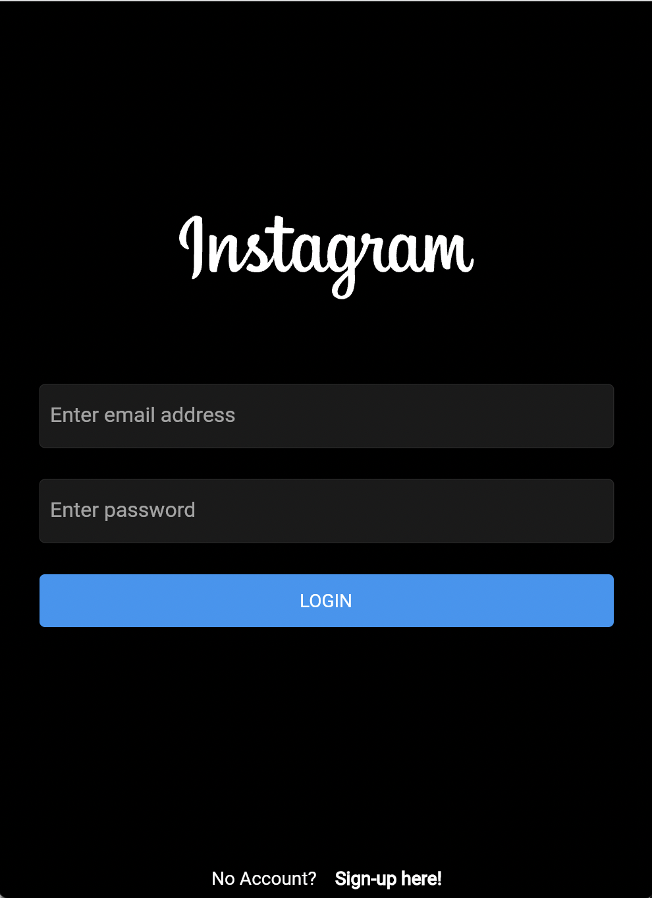
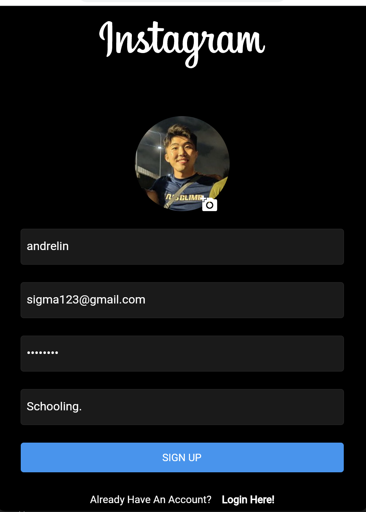
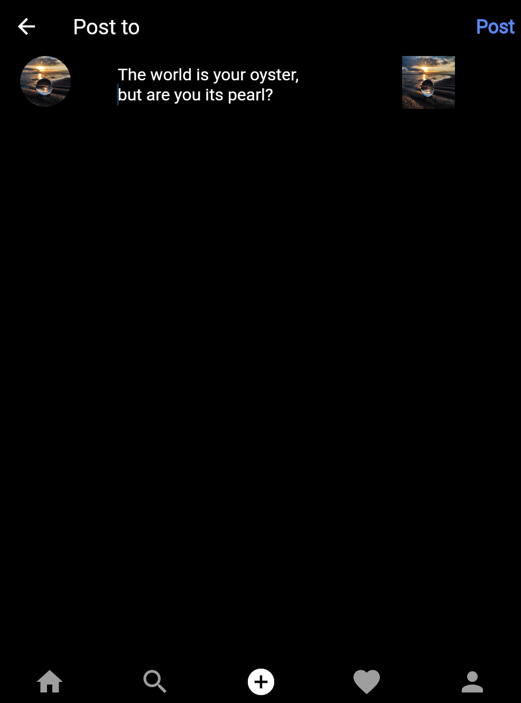

# Instagram Clone

This repository contains code for a full-stack implementation of Instagram. This is a personal implementation as part of learning web-mobile app development and some of the features may be displayed differently or entirely omitted.

## Progress
NOT COMPLETED! Currently working on front-end display. On hiatus to mug..

## Frameworks
Front-end: Flutter
Back-end: Firebase

## Features
### Login page

### Sign-up page

### Home page
TBD

### Post page

## Contributors